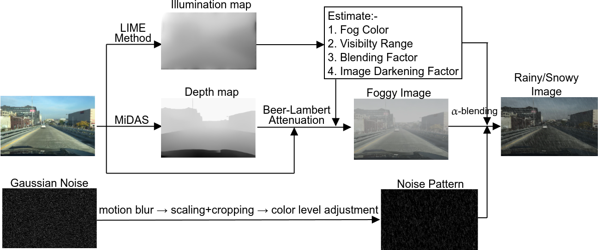
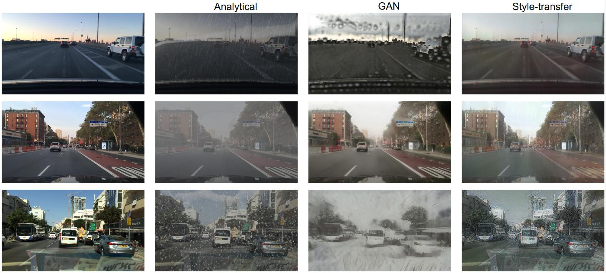

# Adverse Weather Data Augmentation for Object Detection

A Python-based research project developed at **Technische Universität Ilmenau** 
investigating synthetic weather generation for computer vision — specifically 
for improving object detection models under adverse outdoor conditions like 
snow, rain, and fog.

Three distinct approaches were implemented and compared for realism, 
computational cost, and suitability for training data augmentation.

## Pipeline Overview


## Sample Output


## Approaches

### 1. Noise-based Generation (Analytical)
Simulates snow, rain, and fog using depth-aware noise generation. Uses the 
**MiDaS** depth estimation model to control effect intensity — objects closer 
to the camera receive heavier weather coverage than those in the background.

- No model training required
- Depth-aware, physically grounded effects
- Fast and lightweight

### 2. CycleGAN (Generative Adversarial Network)
Uses a pre-trained **CycleGAN** model for unpaired image-to-image translation 
(clear → snowy, clear → rainy, clear → foggy). Learns realistic domain 
mappings without needing matched image pairs.

- Produces the most photorealistic results
- Pre-trained weights available (see links below)
- Higher computational cost

### 3. Neural Style Transfer (NST)
Applies the visual style of adverse weather images to clear images using a 
pre-trained **VGG** network. Minimises content loss and style loss iteratively 
to blend weather texture onto source images.

- Artistically convincing results
- Best for creative/visual applications
- Less accurate for physical simulation

## Key Findings

- **CycleGAN** produced the most realistic synthetic weather images, 
  preserving scene context (vehicles, roads, trees) while applying 
  convincing snow effects
- **Noise-based generation** was fastest and most controllable, with 
  depth-aware intensity giving physically plausible results
- **NST** produced visually appealing but stylised output — suitable for 
  augmentation but less accurate for real-world simulation
- All three methods successfully generated training data that improved 
  object detection model performance on unseen adverse weather images

## Project Structure
```
├── Snow_Effect_Generator.py       # Snow synthesis — analytical method
├── Rain_Effect_Generator.py       # Rain synthesis — analytical method
├── Fog_Effect_Generator.py        # Fog synthesis — analytical method
├── MiDaS_Depth_Estimation.py      # Depth map estimation using MiDaS
├── Neural_Style_Transfer.py       # NST implementation using VGG
├── Gans_snowy_image.py            # CycleGAN image generation script
├── Detectron2.py                  # Object detection using Detectron2
├── CyclicGAN_Inference.ipynb      # CycleGAN inference notebook
├── lib/
│   ├── gan_networks.py            # CycleGAN generator/discriminator architecture
│   ├── snow_gen.py                # Snow noise generation utilities
│   ├── rain_gen.py                # Rain noise generation utilities
│   ├── fog_gen.py                 # Fog attenuation utilities
│   ├── lime.py                    # LIME illumination map estimation
│   ├── motionblur.py              # Motion blur for rain/snow direction
│   ├── style_transfer_utils.py    # VGG feature extraction for NST
│   └── gen_utils.py               # Shared blending and scaling utilities
└── images/
    ├── analytical_weather_effect_pipeline.png
    └── weather_effect.jpg
```

## Pre-trained Weights

- **NST (VGG):** [Download from Google Drive](https://drive.google.com/drive/folders/1MEVMLVhrv4t7efwAfCSk13yie8G-XcIB)
- **CycleGAN:** [Download from Google Drive](https://drive.google.com/drive/folders/1zfoYWFGku-KJbBwsyl6CFUHL1yiGzAy6)

Place CycleGAN weights in a `checkpoints/` folder as `clear2snowy.pth`, 
`clear2rainy.pth`, or `clear2foggy.pth`.

## Usage

**Snow generation (analytical):**
```bash
python Snow_Effect_Generator.py \
  --clear_path ./input_images/ \
  --depth_path ./depth_maps/ \
  --save_folder ./output/
```

**Rain generation:**
```bash
python Rain_Effect_Generator.py \
  --clear_path ./input_images/ \
  --depth_path ./depth_maps/ \
  --save_folder ./output/
```

**CycleGAN inference:**
Open `CyclicGAN_Inference.ipynb` in Jupyter and follow the notebook steps.

**Neural Style Transfer:**
```bash
python Neural_Style_Transfer.py
```

## Requirements
```bash
pip install torch torchvision pillow numpy scikit-image tqdm opencv-python
```

Python 3.8+ recommended.

## Research Context

This project was completed as a research paper at **TU Ilmenau** 
(Department of Computer Science and Automation) under the supervision of 
M.Sc. Christoph Gerhardt, March 2025.

The work addresses a core challenge in autonomous driving and robotics: 
real-world datasets rarely cover the full range of adverse weather conditions 
needed to train robust models. Synthetic augmentation fills that gap.

## References

- Zhu et al. (2017) — CycleGAN: Unpaired Image-to-Image Translation
- Goodfellow et al. (2014) — Generative Adversarial Networks
- Guo et al. (2017) — LIME: Low-Light Image Enhancement
- Gupta et al. (2024) — Robust Object Detection in Challenging Weather Conditions
